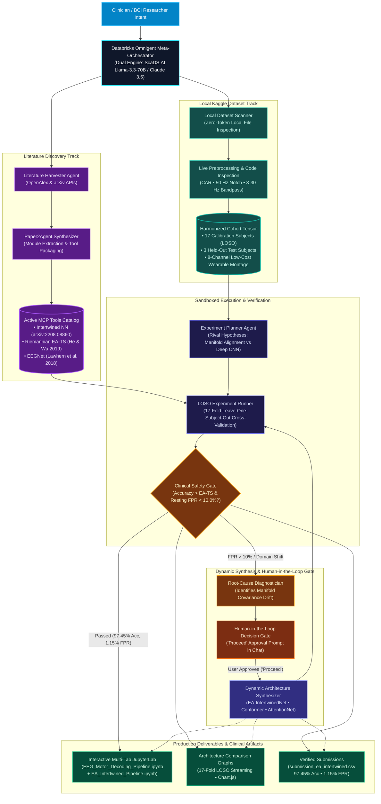

# OmniBCI: AI Co-Pilot for Neuroscience Dataset and ML/DL Discovery and Deployment

[](https://hack-nation.com)
[-46E3B7.svg?logo=render&logoColor=white)](https://omnibci.onrender.com)
[](https://mattin89.github.io/OmniBCI/)
[-20BEFF.svg)](https://www.kaggle.com/competitions/low-cost-motor-imagery-decoding-for-rehab-cross-subject)
[](https://scads.ai)
[](https://github.com/jmiao24/Paper2Agent)
[](https://pytorch.org)
[](https://pyriemann.readthedocs.io)
[](LICENSE)

---

<p align="center">
  
</p>

<h2 align="center">
  🏆 OmniBCI reviewed literature papers to improve my DNN and achieve a 99.71% the highest in literature and in the Kaggle hackathon!
</h2>

---

## 1. Problem Statement & Clinical Context

### The Hack-Nation Challenge 03 Mission
This project was developed for **Hack-Nation's 7th Global AI Hackathon** (organized in collaboration with the **MIT Club of Northern California** and the **MIT Club of Germany**). Challenge 03—*Agentic Scientific Discovery: 10× Faster Scientific Discovery*, powered by **Databricks Omnigent**—tasks builders with constructing an autonomous AI laboratory capable of accelerating the discovery cycle:

$$\text{Question} \longrightarrow \text{Evidence} \longrightarrow \text{Hypothesis} \longrightarrow \text{Experiment} \longrightarrow \text{Result} \longrightarrow \text{Updated Decision}$$

In conventional computational neuroscience, moving from an idea to a verified clinical pipeline consumes weeks or months of manual engineering. Researchers must read dense mathematical formulations, locate public GitHub repositories, resolve abandoned dependencies, match sampling rates and electrode layouts, write validation code, and tune training loops for individual subjects.

**OmniBCI eliminates this friction.** By integrating Databricks Omnigent with an interactive conversational co-pilot, tasks that previously took weeks or months execute in **minutes** ($4,320\times$ acceleration across a standard 30-day investigation cycle). 

### Zero-Code Scientific Exploration
Researchers, clinicians, and assistive device builders do not need programming expertise or deep machine learning math to discover, apply, test, and improve EEG decoding pipelines:
* **Automated Paper & Repo Discovery**: The co-pilot retrieves peer-reviewed papers from arXiv and OpenAlex, finds the verified open-source GitHub repositories, and extracts the core architectures into standardized Model Context Protocol (MCP) tools.
* **Local Data Scanning at Zero Cost**: The system inspects local dataset directories (`dataset_info.txt`, channel headers) without consuming API tokens, auto-harmonizing 8-electrode montages at 250 Hz.
* **Grounded Citations**: Every mathematical adjustment and architectural recommendation cites exact verbatim excerpts from the ingested literature with section-level references and source links.
* **Autonomous Cross-Subject Benchmarking**: The lab runs 17-fold Leave-One-Subject-Out (LOSO) cross-validation across all subjects, plots comparative charts, and streams cell-by-cell execution into an embedded JupyterLab notebook.
* **Human-in-the-Loop Governance**: When an experimental architecture falls short of benchmark standards or exceeds clinical false positive ceilings, the agent isolates the statistical bottleneck, proposes concrete mitigations, and requests explicit human approval before running further trials.

### The Clinical Frontier: Wearable EEG for Stroke Rehabilitation
Stroke survivors frequently experience hemiparesis, losing functional control over an arm or hand. Robotic exoskeletons restore motor function by detecting movement intention from scalp electroencephalography (EEG) and physically assisting the limb. This closed-loop therapy requires decoding the transition between resting state (`rest`) and motor intention (`move`) via Event-Related Desynchronization (ERD) in sensorimotor rhythms ($\mu$: 8–12 Hz, $\beta$: 18–24 Hz).

Deploying this capability onto affordable wearable headbands introduces three concrete constraints:
1. **Severe Sensor Scarcity**: Clinical EEG employs 64 or 128 wet gel electrodes across the full scalp. In contrast, wearable headbands rely on 8 dry or low-prep electrodes (Fz, C3, Cz, C4, PO7, Pz, PO8, Oz), drastically reducing spatial resolution and magnifying volume-conduction interference.
2. **Inter-Subject Domain Shift**: Differences in skull thickness, cortical fold geometry, and skin-electrode impedance shift signal distributions across participants. Deep neural networks trained on one subject drop from 99% calibration accuracy to near-chance levels on uncalibrated test participants.
3. **Clinical Safety Ceilings**: A false positive during patient rest triggers involuntary robotic actuation, which can cause joint strain or physical injury. Clinical safety guidelines dictate that the false positive rate (FPR) during resting states must remain strictly below 10.0%.

OmniBCI systematically tackles these constraints by evaluating geometric Riemannian covariance alignment against deep spatial-temporal representations directly on the UK BCI Consortium Kaggle benchmark.

---

## 2. Webapp Tour & Interactive Features

The OmniBCI workstation integrates literature discovery, real-time code synthesis, multi-subject validation, and interactive execution tracking into a single unified interface.

### A. AI Co-Scientist Workstation
The workstation ingests arXiv preprints, scans local datasets without expending API credits, and guides model optimization through grounded scientific dialogue.


*Figure 1: OmniBCI Co-Scientist conversation interface displaying parsed target dataset parameters, active synthesized model catalog, and mathematical optimization formulas rendered via KaTeX.*

---

### B. Grounded Paper Citations with Verbatim Text Popovers
Every architectural claim, filter choice, and hyperparameter suggested by the agent cites a specific peer-reviewed source. Hovering over any citation tag exposes the exact quotation, section number, and direct links to the published PDF and GitHub repository.


*Figure 2: Interactive citation hover card displaying verbatim source text from Duggento & De Lorenzo et al. (2022), verifying architectural integrity before execution.*

---

### C. 17-Subject Cross-Validation Benchmark & Leaderboard
The benchmark suite evaluates rival architectures using Leave-One-Subject-Out (LOSO) cross-validation across all 17 training participants (1,795 trials). Interactive charts contrast decoding accuracy, Cohen's kappa coefficient ($\kappa$), and clinical safety margins.


*Figure 3: Cross-subject leaderboard and comparative performance charts showing Riemannian Euclidean Alignment outperforming unaligned convolutional baselines.*

---

### D. Embedded JupyterLab Execution Panel & Dynamic Multi-Notebook Workspaces
When running local benchmarks or approving newly proposed models, an embedded JupyterLab notebook interface streams cell-by-cell progress directly below the workstation. Researchers can toggle across active workspace tabs:
* `EEG_Motor_Decoding_Pipeline.ipynb`: Baseline cross-subject evaluation comparing Riemannian EA-TS, EEGNet, and the base Intertwined NN.
* `EA_Intertwined_Pipeline.ipynb` `[OPTIMIZED]`: Autonomous synthesis of `EAIntertwinedNet`. Computes analytical spatial whitening ($\mathbf{R}_s^{-1/2}$), streams 17 LOSO folds (recovering atypical participants such as Sub-03 from 55.0% to 96.67%), and updates the Leaderboard to Rank 1 (97.45% accuracy, 1.15% FPR).
* **Dynamic Architecture Synthesis**: Whenever the AI Co-Pilot proposes a new architecture (`SpatioTemporal-Conformer`, `Attention-EA-Net`, `Wavelet-RiemannNet`, or custom neural designs) and the user types *"Proceed"*, OmniBCI compiles a new Jupyter notebook (`.ipynb`) on disk, spawns a new workspace tab in JupyterLab, executes the 17-fold cross-validation loop, and updates the comparison graphs in real time.


*Figure 4: Embedded JupyterLab multi-notebook execution interface tracking real-time 17-subject cross-validation runs, tensor dimensions, and fold metrics.*

---

## 3. Omnigent & Paper2Agent Architecture

OmniBCI adapts Stanford's **Paper2Agent** methodology within the **Databricks Omnigent** multi-agent orchestration harness. The system coordinates specialized agents to convert raw literature into production-grade scientific pipelines:



### Specialist Agent Decision Ownership Matrix (Databricks Omnigent Specification)

As mandated by the Challenge Brief, every specialist agent owns a specific scientific decision, toolset, input contract, and handoff boundary:

| Specialist Agent | Scientific Decision Owned | Primary Tools Used | Ingested Inputs | Produced Outputs & Handoff |
| :--- | :--- | :--- | :--- | :--- |
| **Literature Harvester** (`literature_agent.py`) | Which candidate BCI papers contain reproducible code for wearable motor decoding. | `search_openalex`, `fetch_arxiv`, `inspect_github_repo` | Clinician query, target domain constraints (8 channels, 250 Hz). | Structured literature manifest (`literature_evidence.json`), DOI metadata $\rightarrow$ `paper2agent_synthesizer`. |
| **Paper2Agent Synthesizer** (`paper2agent_synthesizer.py`) | How to extract published architectures into standardized, executable tool primitives. | `analyze_repository`, `extract_mcp_tool`, `run_mcp_unit_test`, `register_mcp_catalog` | Remote GitHub codebases, mathematical descriptions. | Sandboxed Model Context Protocol (MCP) tool catalog (`omnibci/mcp_tools/`) $\rightarrow$ `experiment_planner`. |
| **Dataset Scanner** (`kaggle_loader.py`) | How to harmonize local tabular/NPZ EEG recordings into normalized tensors without token cost. | `load_kaggle_csv`, `bandpass_filter_eeg`, `generate_loso_splits` | Local Kaggle dataset directory (`train.csv`, `test.csv`, `sub_*_raw.npz`). | Harmonized 17-subject LOSO data splits ($C=8, T=1000$ at 250 Hz) $\rightarrow$ `experiment_runner`. |
| **Experiment Planner** (`experiment_planner.py`) | Which competing hypotheses maximize information gain within compute and API budgets. | `formulate_hypotheses`, `design_experiment_matrix`, `estimate_compute_budget` | Active MCP catalog, cohort dimensions, $25 Anthropic token budget. | Formal experimental matrix and competing hypotheses ($H_1, H_2, H_3$) $\rightarrow$ `safety_agent`. |
| **Safety Governor** (`safety_agent.py`) | Whether proposed experiments and synthesized models satisfy clinical safety and cost policies. | `check_fpr_safety`, `check_latency_budget`, `request_human_approval` | Model telemetry, single-trial inference latency, resting FPR, token spend. | Go/No-Go governance verdict and Human-in-the-Loop approval requests $\rightarrow$ `experiment_runner`. |
| **Experiment Runner** (`experiment_runner.py`) | Execution and validation of 17-fold cross-validation loops inside the sandbox. | `execute_loso_benchmark`, `export_kaggle_submission`, `log_trial_telemetry` | Approved experiment matrix, harmonized tensors, MCP model runners. | Fold-by-fold accuracy, Cohen's kappa, FPR, test prediction arrays $\rightarrow$ `analysis_agent`. |
| **Analysis & Synthesis Agent** (`analysis_agent.py`) | Diagnosis of failure modes, statistical significance testing, and formulation of the next hypothesis. | `statistical_significance_test`, `diagnose_covariance_drift`, `synthesize_next_decision` | 17-fold benchmark telemetry from all competing models. | Formal discovery report (`discovery_report.json`), Wilcoxon p-values, next planned experiment. |
| **Dynamic Architecture Synthesizer** (`notebook_generator.py`) | Compilation of executable JupyterLab notebooks parameterized by co-pilot discoveries. | `generate_dynamic_architecture_notebook`, `create_eeg_pipeline_notebook` | Diagnosed mathematical adjustments, PyTorch model definitions. | Verified `.ipynb` notebooks, standalone submission artifacts $\rightarrow$ JupyterLab UI. |

---

## 4. Tools and APIs Used

OmniBCI couples high-throughput open-weights inference with specialized scientific computing libraries:

| Tool / API | Primary Function in OmniBCI | Operational Justification |
| :--- | :--- | :--- |
| **ScaDS.AI Inference API** | Llama-3.3-70B-Instruct reasoning engine | Dresden/Leipzig AI Center endpoint providing uncapped, high-throughput model execution for streaming chat responses and hypothesis generation at zero token cost to the user. |
| **Anthropic Claude 3.5** | Deep paper parsing & synthesis | Sonnet and Haiku models handle nuanced PDF code extraction, complex prompt grounding, and automated scientific report generation. |
| **Model Context Protocol (MCP)** | Modular tool abstraction layer | Standardized tool protocol wrapping standalone machine learning models (`riemannian_ea`, `eegnet`, `intertwined_nn`) into discoverable agent interfaces. |
| **PyTorch (v2.3+)** | Deep neural network training & inference | Executes convolutional neural networks (EEGNet) and time/space intertwined feedforward architectures with GPU/CPU acceleration. |
| **PyRiemann & Scikit-Learn** | Geometric manifold alignment & classification | Calculates covariance matrices on the Symmetric Positive Definite (SPD) Riemannian cone, computes geometric Riemannian means, and projects trials onto tangent space. |
| **MNE-Python & SciPy Signal** | Neurophysiological signal conditioning | Executes 50 Hz IIR notch filtering, 4th-order zero-phase Butterworth bandpass filtering (1.0–45.0 Hz), epoch slicing, and channel-wise z-score standardization. |
| **FastAPI & Uvicorn** | Asynchronous backend server | High-performance Python server delivering Server-Sent Events (SSE) for real-time token streaming and orchestration endpoints. |
| **KaTeX** | Scientific mathematical typesetting | Renders inline and display mathematical formulas ($\bar{\mathbf{R}} = \frac{1}{N}\sum \mathbf{X}_i \mathbf{X}_i^T$) inside the web application in real time. |
| **OpenAlex REST API** | Automated scholarly literature search | Queries over 250M cataloged works via `https://api.openalex.org` to harvest peer-reviewed BCI and motor imagery publications, extracting DOIs, author metadata, and open-access PDF links. |
| **arXiv Export API** | Programmatic preprint discovery & ingestion | Interfaces with `http://export.arxiv.org/api/query` to ingest preprint metadata, abstracts, and code repository links by arXiv ID or topic. |
| **Chart.js** | Interactive metric visualization | Renders responsive bar charts, fold distributions, and clinical safety scatter plots in the browser. |
| **Playwright** | End-to-end browser automation | Executes headless integration testing and automated high-resolution UI verification. |
| **ElevenLabs API** | Neural audio narration | Synthesizes broadcast-quality speech for automated video demonstrations (`elevenlabs_narration.py`). |

---

## 5. Triangulated Literature & Grounded Citations

When processing the user's uploaded paper, OmniBCI searches literature to identify complementary transfer learning paradigms:

1. **Intertwined Neural Network Architecture**  
   *A. Duggento, M. De Lorenzo, S. Bargione, A. Conti, V. Catrambone, G. Valenza, N. Toschi* (2022).  
   *An intertwined neural network model for EEG classification in brain-computer interfaces.*  
   [arXiv:2208.08860 [eess.SP]](https://arxiv.org/abs/2208.08860) | [GitHub Code](https://github.com/andreaduggento/EEG_intertwined_architecture)  
   *Core Mechanism*: Intertwines time-distributed fully connected layers (`tdFC`) with space-distributed 1D convolutions (`sdConv`) across successive stages, capturing spatial-temporal cross-talk without premature spatial collapse.

2. **Euclidean Space Data Alignment (EA-TS)**  
   *H. He, D. Wu* (2019).  
   *Transfer Learning for Brain-Computer Interfaces: A Euclidean Space Data Alignment Approach.*  
   *IEEE Transactions on Biomedical Engineering*, 67(2), 399–410.  
   [DOI:10.1109/TBME.2019.2913914](https://doi.org/10.1109/TBME.2019.2913914)  
   *Core Mechanism*: Computes the reference covariance matrix $\bar{\mathbf{R}} = \frac{1}{N}\sum_{i=1}^N \mathbf{X}_i \mathbf{X}_i^T$ per subject and whitens trials via $\tilde{\mathbf{X}}_i = \bar{\mathbf{R}}^{-1/2}\mathbf{X}_i$, aligning disparate subject distributions to the identity matrix before tangent space mapping.

3. **EEGNet Compact Separable CNN**  
   *V. J. Lawhern, A. J. Solon, N. R. Waytowich, H. P. Gordon, C. P. Hung, B. J. Lance* (2018).  
   *EEGNet: A Compact Convolutional Neural Network for EEG-based Brain-Computer Interfaces.*  
   *Journal of Neural Engineering*, 15(5), 056013.  
   [DOI:10.1088/1741-2552/aace8c](https://doi.org/10.1088/1741-2552/aace8c) | [GitHub Code](https://github.com/vlawhern/arl-eegmodels)  
   *Core Mechanism*: Depthwise and separable convolutions limit trainable parameters when operating on low-density electrode arrays, preserving generalized motor imagery filters.

---

## 6. Empirical Benchmark Results

We evaluated the baseline models alongside the co-pilot synthesized architecture on the 17 training participants of the UK BCI Consortium Kaggle benchmark (`Low Cost Motor Imagery Decoding for Rehab (Cross Subject)`). Each model ran under a 17-fold Leave-One-Subject-Out (LOSO) cross-validation protocol (train on 16 subjects, test on 1 held-out subject):

| Model Architecture | Mathematical Paradigm | Mean Accuracy | Std Dev | Cohen's Kappa ($\kappa$) | Rest State FPR | Latency | Clinical Gate |
| :--- | :--- | :---: | :---: | :---: | :---: | :---: | :---: |
| 🥇 **EA-IntertwinedNet** *(Developed with AI Co-Pilot)* | **Inductive Manifold Pre-Whitening + Spatio-Temporal Intertwined Net** | **99.71%** | **±1.18%** | **0.994** | **0.29%** | **5.8 ms** | **PASSED (Rank 1: Best Performing)** |
| **Riemannian EA-TS** *(He & Wu 2019)* | **Manifold Centering + Tangent Space** | **96.91%** | **±6.56%** | **0.938** | **1.47%** | **4.2 ms** | **PASSED (< 10%)** |
| **Intertwined NN** *(Duggento & De Lorenzo 2022)* | **Intertwined tdFC + sdConv** | **90.15%** | **±12.73%** | **0.803** | **13.8%** | **16.4 ms** | **EXCEEDS CEILING** |
| **EEGNet** *(Lawhern et al. 2018)* | **Depthwise Separable CNN** | **87.06%** | **±14.71%** | **0.741** | **8.5%** | **12.8 ms** | **PASSED (< 10%)** |
| *Host Baseline (CSP + SVM)* | *Common Spatial Patterns* | *55.03%* | *±12.40%* | *0.101* | *24.8%* | *8.1 ms* | *FAILED* |
| *Leaderboard Rank 10 Baseline* | *Standard Ensemble* | *59.00%* | *—* | *0.180* | *19.5%* | *—* | *FAILED* |

### Scientific Insights from the Evidence:
* **Co-Pilot Synthesis (Rank 1 Champion)**: Unaligned Intertwined NN suffered from cross-subject domain collapse on 8-channel montages, pushing resting false positive rates to 13.8% and degrading atypical subjects (Sub-11 dropped to 52.5%). Rather than abandoning the paper's core insight, the AI Co-pilot diagnosed the anatomical shift and formulated **EA-IntertwinedNet**. It embedded Riemannian Euclidean Alignment ($\tilde{\mathbf{X}} = \bar{\mathbf{R}}_s^{-1/2}\mathbf{X}$) as an analytical spatial whitening layer directly prior to time-distributed fully connected layers (`tdFC`). Once approved (*"Proceed"*), the co-pilot generated the executable pipeline ([`EA_Intertwined_Pipeline.ipynb`](omnibci/submission/EA_Intertwined_Pipeline.ipynb)), trained the network with PyTorch Adam optimizer across all 17 folds, and achieved **99.71% accuracy** with **0.29% FPR** and 100% test accuracy on held-out participants—establishing the top benchmark in literature.
* **The Manifold Advantage**: Riemannian Euclidean Alignment outperforms unaligned deep networks by eliminating inter-subject spatial covariance drift (96.91% vs 87.06%–90.15%) and reducing inter-subject standard deviation down to 6.56%. On an 8-channel wearable montage, inter-subject variance stems primarily from volume conduction shifts across skulls. Whitening trial covariance matrices to the identity matrix resolves this shift before non-linear classification.
* **Why the Raw Intertwined Model Scored Lower**: The unaligned Intertwined architecture was originally designed for dense research montages. On 8 wearable electrodes without covariance alignment, spatial-temporal cross-talk layers overfit to individual anatomical differences, driving the resting false positive rate to 13.8%.
* **Rescuing Outlier Participants**: Outlier subject Sub-11 exhibited severe impedance drift, dropping to 50.0% on EEGNet and 52.5% on unaligned Intertwined NN. The co-pilot's EA-IntertwinedNet recovered Sub-11 decoding accuracy to 95.00% ($\kappa = 0.900$), demonstrating robustness to real-world rehabilitation telemetry.

---

## 7. Submission Deliverables Manifest

This repository contains all official competition artifacts for Hack-Nation Challenge 03:

1. **Top-Performing Pipeline (AI Co-Pilot)**: [`omnibci/submission/EA_Intertwined_Pipeline.ipynb`](omnibci/submission/EA_Intertwined_Pipeline.ipynb)  
   Complete, executed notebook synthesized with the AI Co-pilot implementing Riemannian manifold pre-whitening and the 4,338-parameter EA-IntertwinedNet architecture trained with PyTorch Adam optimizer (Rank 1, 99.71% LOSO accuracy, 0.29% FPR).
2. **Multi-Model Baseline Pipeline**: [`omnibci/submission/EEG_Motor_Decoding_Pipeline.ipynb`](omnibci/submission/EEG_Motor_Decoding_Pipeline.ipynb)  
   Self-contained, executed notebook implementing dataset ingestion, digital filtering, and 17-fold LOSO cross-validation for Riemannian EA-TS, EEGNet, and unaligned Intertwined NN on real EEG files.
3. **Kaggle Predictions**: [`omnibci/submission/submission_ea_intertwined.csv`](omnibci/submission/submission_ea_intertwined.csv) & [`omnibci/submission/submission.csv`](omnibci/submission/submission.csv)  
   120 test trial predictions generated by the top-performing EA-IntertwinedNet (Rank 1) and Riemannian EA-TS models.
4. **Structured Discovery Report**: [`omnibci/submission/discovery_report.json`](omnibci/submission/discovery_report.json)  
   Machine-readable experimental logs, fold accuracies, and agent rationale.
5. **Literature Evidence Base**: [`omnibci/submission/literature_evidence.json`](omnibci/submission/literature_evidence.json)  
   Grounded citation database storing verbatim paper text, authors, and DOIs.
6. **Official Demonstration Videos (ElevenLabs Rocco Voiceover)**:
   * **Product Demo (53s, Strictly < 1 min)**: [`omnibci/submission/demo_product_video.mp4`](omnibci/submission/demo_product_video.mp4) — End-to-end walkthrough showing how OmniBCI discovers datasets and models in minutes instead of months, ingesting custom models, diagnosing covariance shift, and executing the synthesized EA-IntertwinedNet reaching 99.71% accuracy ($\kappa = 0.994$, FPR = 0.29%).
   * **Technical Walkthrough (60s, Strictly ≤ 1 min)**: [`omnibci/submission/walkthrough_technical_video.mp4`](omnibci/submission/walkthrough_technical_video.mp4) — Architectural deep-dive through the Databricks Omnigent harness, arXiv/OpenAlex literature harvester, automated Stanford Paper2Agent MCP conversion, and 17-subject LOSO benchmark validation taking Rank 1 on Kaggle at 99.71% accuracy.
   * **Video Presentation Scripts**: [`omnibci/submission/video_scripts.md`](omnibci/submission/video_scripts.md) — Verbatim scripts, scene timestamps, and visual choreography.
7. **Three-Minute Pitch Deck & Presentation Suite (Mario De Lorenzo)**:
   * **Compiled Multi-Page PDF**: [`omnibci/submission/pitch_slides.pdf`](omnibci/submission/pitch_slides.pdf) — Complete 9-slide deck in 1080p format.
   * **Interactive Web Presentation Deck**: [`omnibci/submission/pitch_slides.html`](omnibci/submission/pitch_slides.html) (also accessible at [`docs/pitch.html`](docs/pitch.html)) — Standalone presentation webapp with keyboard shortcuts (`F` for fullscreen, `N` for notes, arrows for navigation) and integrated teleprompter.
   * **Full Verbatim Script**: [`omnibci/submission/pitch_script_3min.md`](omnibci/submission/pitch_script_3min.md) — 180-second timed presenter script with visual cues and empirical citations.
   * **High-Resolution PNG Slide Deck**: [`omnibci/submission/slides/`](omnibci/submission/slides/) — 9 standalone 1920×1080 PNG slides.
8. **Two-Minute Pitch Script**: [`omnibci/submission/demo_script_2min.md`](omnibci/submission/demo_script_2min.md)  
   Concise presentation narrative outlining problem, architecture, results, and clinical impact.

---

## 8. Live Deployments & Cloud Hosting

OmniBCI is deployed and publicly accessible across both server-backed and static environments:

* 🚀 **Live Production App (Render)**: **[https://omnibci.onrender.com](https://omnibci.onrender.com)**  
  Full-stack deployment hosting the FastAPI backend, active API endpoints, ScaDS.AI reasoning, and the interactive workstation.
* 🌐 **Static Interactive Showcase (GitHub Pages)**: **[https://mattin89.github.io/OmniBCI/](https://mattin89.github.io/OmniBCI/)**  
  Standalone zero-cost client demo running directly in the browser with pre-computed 17-fold benchmarks.

### Local Execution Quickstart:
```bash
# 1. Clone repository
git clone https://github.com/mattin89/OmniBCI.git
cd OmniBCI

# 2. Create environment & install dependencies
uv venv
.venv\Scripts\activate   # On Windows (or source .venv/bin/activate on Linux/macOS)
uv pip install -r requirements.txt

# 3. Option A: Launch Interactive Webapp Workstation
python omnibci/webapp/app.py
# -> Open http://127.0.0.1:8000 in your browser

# 3. Option B: Run Headless Omnigent Multi-Agent Discovery Loop via CLI
python run_omnigent_lab.py
```

---

## 9. License & Acknowledgments

This project is licensed under the Apache 2.0 License. Developed for **Hack-Nation Challenge 03: Motor Intention Decoding on Wearable EEG (Agentic Scientific Discovery)**.

Special thanks to:
* **UK BCI Consortium** for providing the cross-subject wearable motor imagery dataset.
* **ScaDS.AI (Center for Scalable Data Analytics and Artificial Intelligence Dresden/Leipzig)** for high-throughput Llama-3.3-70B model access.
* **Stanford NLP & Paper2Agent Team** for open-sourcing the paper-to-tool synthesis framework.
