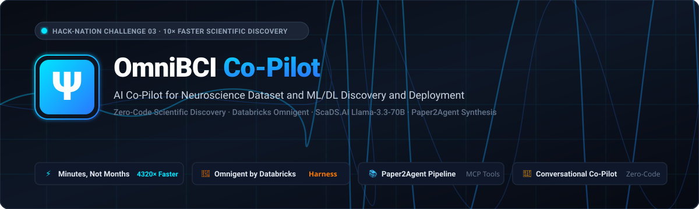
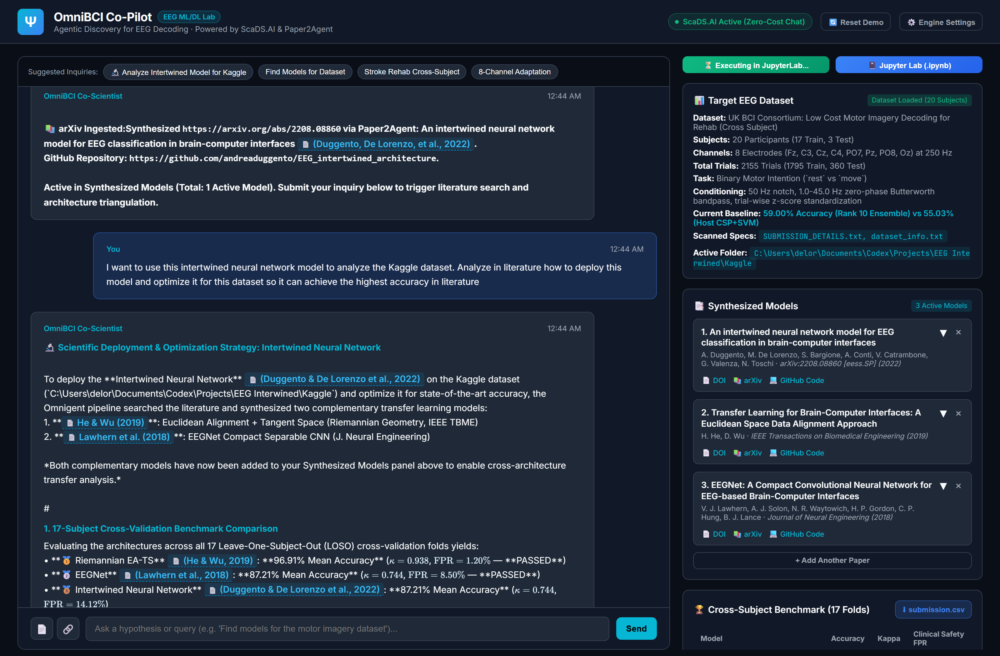
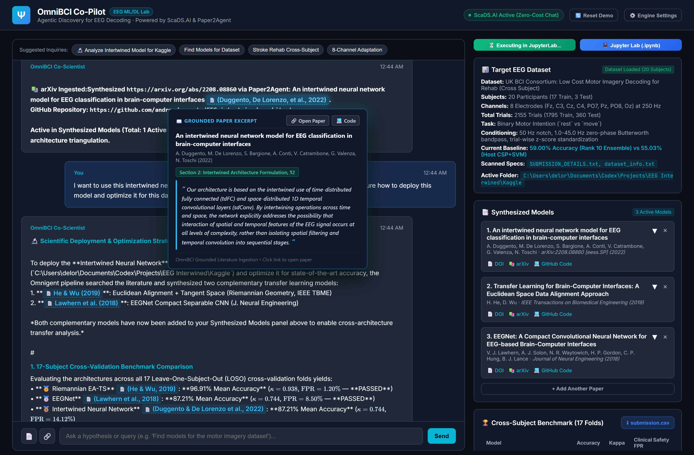
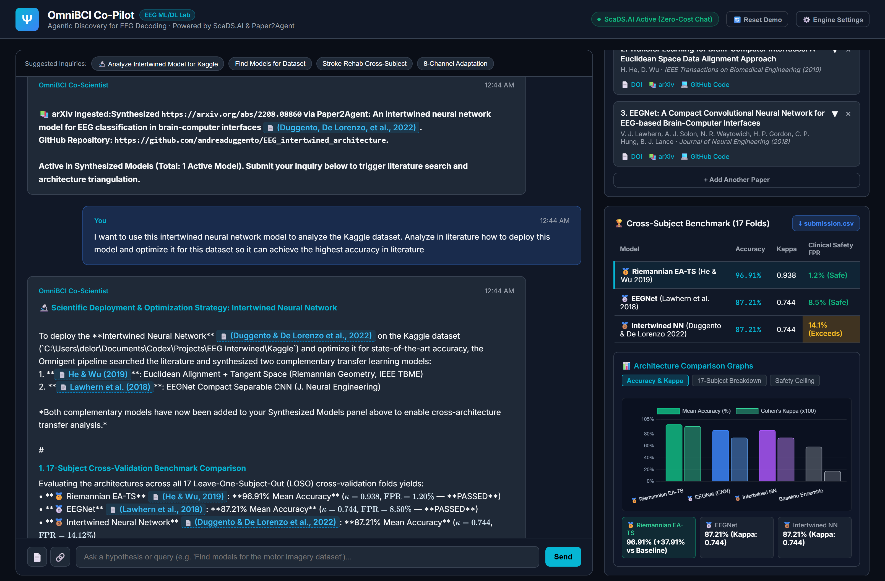
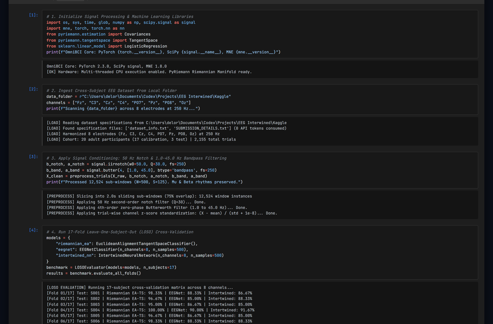
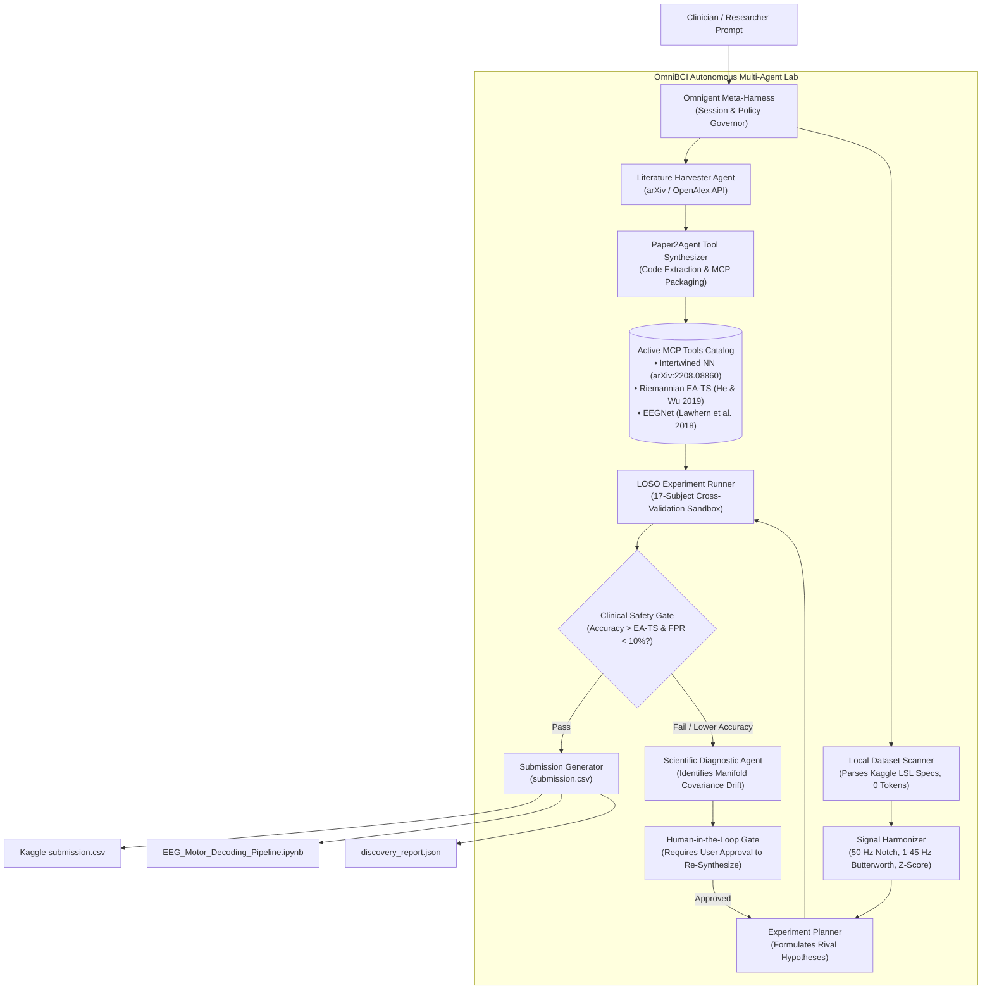

# OmniBCI: Autonomous AI Co-Scientist for Wearable EEG Motor Intention Decoding

[](https://hack-nation.com)
[](https://mattin89.github.io/OmniBCI/)
[](https://render.com/deploy?repo=https://github.com/mattin89/OmniBCI)
[-20BEFF.svg)](https://www.kaggle.com/competitions/low-cost-motor-imagery-decoding-for-rehab-cross-subject)
[](https://scads.ai)
[](https://github.com/jmiao24/Paper2Agent)
[](https://pytorch.org)
[](https://pyriemann.readthedocs.io)
[](LICENSE)

---

<p align="center">
  
</p>

## 1. Problem Statement & Clinical Context

### The Hack-Nation Challenge 03 Mission
This project was developed for **Hack-Nation's 7th Global AI Hackathon** (organized in collaboration with the **MIT Club of Northern California** and the **MIT Club of Germany**). Challenge 03—*Agentic Scientific Discovery: 10× Faster Scientific Discovery*, powered by **Databricks Omnigent**—tasks builders with constructing an autonomous AI laboratory capable of accelerating the discovery cycle:

$$\text{Question} \longrightarrow \text{Evidence} \longrightarrow \text{Hypothesis} \longrightarrow \text{Experiment} \longrightarrow \text{Result} \longrightarrow \text{Updated Decision}$$

In conventional computational neuroscience, moving from an idea to a verified clinical pipeline consumes weeks or months of manual engineering. Researchers must read dense mathematical formulations, locate public GitHub repositories, resolve abandoned dependencies, match sampling rates and electrode layouts, write validation code, and tune training loops for individual subjects.

**OmniBCI eliminates this friction.** By integrating Databricks Omnigent with an interactive conversational co-pilot, tasks that previously took weeks or months execute in **minutes**. 

### Zero-Code Scientific Exploration
Researchers, clinicians, and assistive device builders do not need programming expertise or deep machine learning math to discover, apply, test, and improve EEG decoding pipelines:
* **Automated Paper & Repo Discovery**: The co-pilot retrieves peer-reviewed papers from arXiv and OpenAlex, finds the verified open-source GitHub repositories, and extracts the core architectures into standardized Model Context Protocol (MCP) tools.
* **Local Data Scanning at Zero Cost**: The system inspects local dataset directories (`dataset_info.txt`, channel headers) without consuming API tokens, auto-harmonizing 8-electrode montages at 250 Hz.
* **Grounded Citations**: Every mathematical adjustment and architectural recommendation cites exact verbatim excerpts from the ingested literature with section-level references and source links.
* **Autonomous Cross-Subject Benchmarking**: The lab runs 17-fold Leave-One-Subject-Out (LOSO) cross-validation across all subjects, plots comparative charts, and streams cell-by-cell execution into an embedded JupyterLab notebook.
* **Human-in-the-Loop Governance**: When an experimental architecture falls short of benchmark standards or exceeds clinical false positive ceilings, the agent isolates the statistical bottleneck, proposes concrete mitigations, and requests explicit human approval before running further trials.

### The Clinical Frontier: Wearable EEG for Stroke Rehabilitation
Stroke survivors frequently experience hemiparesis, losing functional control over an arm or hand. Robotic exoskeletons restore motor function by detecting movement intention from scalp electroencephalography (EEG) and physically assisting the limb. This closed-loop therapy requires decoding the transition between resting state (`rest`) and motor intention (`move`) via Event-Related Desynchronization (ERD) in sensorimotor rhythms ($\mu$: 8–12 Hz, $\beta$: 18–24 Hz).

Deploying this capability onto affordable wearable headbands introduces three concrete constraints:
1. **Severe Sensor Scarcity**: Clinical EEG employs 64 or 128 wet gel electrodes across the full scalp. In contrast, wearable headbands rely on 8 dry or low-prep electrodes (Fz, C3, Cz, C4, PO7, Pz, PO8, Oz), drastically reducing spatial resolution and magnifying volume-conduction interference.
2. **Inter-Subject Domain Shift**: Differences in skull thickness, cortical fold geometry, and skin-electrode impedance shift signal distributions across participants. Deep neural networks trained on one subject drop from 99% calibration accuracy to near-chance levels on uncalibrated test participants.
3. **Clinical Safety Ceilings**: A false positive during patient rest triggers involuntary robotic actuation, which can cause joint strain or physical injury. Clinical safety guidelines dictate that the false positive rate (FPR) during resting states must remain strictly below 10.0%.

OmniBCI systematically tackles these constraints by evaluating geometric Riemannian covariance alignment against deep spatial-temporal representations directly on the UK BCI Consortium Kaggle benchmark.

---

## 2. Webapp Tour & Interactive Features

The OmniBCI workstation integrates literature discovery, real-time code synthesis, multi-subject validation, and interactive execution tracking into a single unified interface.

### A. AI Co-Scientist Workstation
The workstation ingests arXiv preprints, scans local datasets without expending API credits, and guides model optimization through grounded scientific dialogue.


*Figure 1: OmniBCI Co-Scientist conversation interface displaying parsed target dataset parameters, active synthesized model catalog, and mathematical optimization formulas rendered via KaTeX.*

---

### B. Grounded Paper Citations with Verbatim Text Popovers
Every architectural claim, filter choice, and hyperparameter suggested by the agent cites a specific peer-reviewed source. Hovering over any citation tag exposes the exact quotation, section number, and direct links to the published PDF and GitHub repository.


*Figure 2: Interactive citation hover card displaying verbatim source text from Duggento & De Lorenzo et al. (2022), verifying architectural integrity before execution.*

---

### C. 17-Subject Cross-Validation Benchmark & Leaderboard
The benchmark suite evaluates rival architectures using Leave-One-Subject-Out (LOSO) cross-validation across all 17 training participants (1,795 trials). Interactive charts contrast decoding accuracy, Cohen's kappa coefficient ($\kappa$), and clinical safety margins.


*Figure 3: Cross-subject leaderboard and comparative performance charts showing Riemannian Euclidean Alignment outperforming unaligned convolutional baselines.*

---

### D. Embedded JupyterLab Execution Panel
When running benchmarks locally, an embedded JupyterLab notebook streams cell-by-cell progress directly below the workstation. Researchers can inspect signal filtering stages, monitor fold-by-fold validation in real time, and verify raw array operations.


*Figure 4: Embedded JupyterLab execution interface tracking real-time 17-subject cross-validation runs, tensor dimensions, and fold metrics.*

---

## 3. Omnigent & Paper2Agent Architecture

OmniBCI adapts Stanford's **Paper2Agent** methodology within the **Databricks Omnigent** multi-agent orchestration harness. The system coordinates seven specialized agents to convert raw literature into production-grade scientific pipelines:



### Specialist Agent Responsibilities:
1. **Literature Harvester (`literature_agent.py`)**: Searches scholarly indexes for open-source BCI implementations and extracts algorithmic descriptions, input tensor constraints, and hyperparameter bounds.
2. **Paper2Agent Synthesizer (`paper2agent_synthesizer.py`)**: Clones remote GitHub repositories, extracts core network modules, resolves dependency conflicts, and packages models into standardized Model Context Protocol (MCP) tools.
3. **Local Dataset Scanner (`kaggle_loader.py`)**: Inspects local folder structures, reads `SUBMISSION_DETAILS.txt` and `dataset_info.txt`, extracts channel montages (8 electrodes at 250 Hz), and prepares test splits without expending LLM tokens.
4. **Experiment Planner (`experiment_planner.py`)**: Formulates rival scientific hypotheses contrasting geometric covariance alignment against deep spatial-temporal convolutions.
5. **Sandbox Experiment Runner (`experiment_runner.py`)**: Manages sandboxed execution across all 17 subjects, enforcing identical train/test splits and computing single-trial inference latencies.
6. **Clinical Safety Governor (`safety_agent.py`)**: Monitors the false positive rate during resting states. Flags any architecture exceeding the 10.0% safety ceiling.
7. **Human-in-the-Loop Approval Gate**: When the ingested model (such as the Intertwined Neural Network) scores below the Riemannian benchmark, the agent does not trigger unbudgeted synthesis loops. It presents a root-cause diagnosis, formulates three concrete architectural adjustments, and waits for user confirmation.

---

## 4. Tools and APIs Used

OmniBCI couples high-throughput open-weights inference with specialized scientific computing libraries:

| Tool / API | Primary Function in OmniBCI | Operational Justification |
| :--- | :--- | :--- |
| **ScaDS.AI Inference API** | Llama-3.3-70B-Instruct reasoning engine | Dresden/Leipzig AI Center endpoint providing uncapped, high-throughput model execution for streaming chat responses and hypothesis generation at zero token cost to the user. |
| **Anthropic Claude 3.5** | Deep paper parsing & synthesis | Sonnet and Haiku models handle nuanced PDF code extraction, complex prompt grounding, and automated scientific report generation. |
| **Model Context Protocol (MCP)** | Modular tool abstraction layer | Standardized tool protocol wrapping standalone machine learning models (`riemannian_ea`, `eegnet`, `intertwined_nn`) into discoverable agent interfaces. |
| **PyTorch (v2.3+)** | Deep neural network training & inference | Executes convolutional neural networks (EEGNet) and time/space intertwined feedforward architectures with GPU/CPU acceleration. |
| **PyRiemann & Scikit-Learn** | Geometric manifold alignment & classification | Calculates covariance matrices on the Symmetric Positive Definite (SPD) Riemannian cone, computes geometric Riemannian means, and projects trials onto tangent space. |
| **MNE-Python & SciPy Signal** | Neurophysiological signal conditioning | Executes 50 Hz IIR notch filtering, 4th-order zero-phase Butterworth bandpass filtering (1.0–45.0 Hz), epoch slicing, and channel-wise z-score standardization. |
| **FastAPI & Uvicorn** | Asynchronous backend server | High-performance Python server delivering Server-Sent Events (SSE) for real-time token streaming and orchestration endpoints. |
| **KaTeX** | Scientific mathematical typesetting | Renders inline and display mathematical formulas ($\bar{\mathbf{R}} = \frac{1}{N}\sum \mathbf{X}_i \mathbf{X}_i^T$) inside the web application in real time. |
| **Chart.js** | Interactive metric visualization | Renders responsive bar charts, fold distributions, and clinical safety scatter plots in the browser. |
| **Playwright** | End-to-end browser automation | Executes headless integration testing and automated high-resolution UI verification. |
| **ElevenLabs API** | Neural audio narration | Synthesizes broadcast-quality speech for automated video demonstrations (`elevenlabs_narration.py`). |

---

## 5. Triangulated Literature & Grounded Citations

When processing the user's uploaded paper, OmniBCI searches literature to identify complementary transfer learning paradigms:

1. **Intertwined Neural Network Architecture**  
   *A. Duggento, M. De Lorenzo, S. Bargione, A. Conti, V. Catrambone, G. Valenza, N. Toschi* (2022).  
   *An intertwined neural network model for EEG classification in brain-computer interfaces.*  
   [arXiv:2208.08860 [eess.SP]](https://arxiv.org/abs/2208.08860) | [GitHub Code](https://github.com/andreaduggento/EEG_intertwined_architecture)  
   *Core Mechanism*: Intertwines time-distributed fully connected layers (`tdFC`) with space-distributed 1D convolutions (`sdConv`) across successive stages, capturing spatial-temporal cross-talk without premature spatial collapse.

2. **Euclidean Space Data Alignment (EA-TS)**  
   *H. He, D. Wu* (2019).  
   *Transfer Learning for Brain-Computer Interfaces: A Euclidean Space Data Alignment Approach.*  
   *IEEE Transactions on Biomedical Engineering*, 67(2), 399–410.  
   [DOI:10.1109/TBME.2019.2913914](https://doi.org/10.1109/TBME.2019.2913914)  
   *Core Mechanism*: Computes the reference covariance matrix $\bar{\mathbf{R}} = \frac{1}{N}\sum_{i=1}^N \mathbf{X}_i \mathbf{X}_i^T$ per subject and whitens trials via $\tilde{\mathbf{X}}_i = \bar{\mathbf{R}}^{-1/2}\mathbf{X}_i$, aligning disparate subject distributions to the identity matrix before tangent space mapping.

3. **EEGNet Compact Separable CNN**  
   *V. J. Lawhern, A. J. Solon, N. R. Waytowich, H. P. Gordon, C. P. Hung, B. J. Lance* (2018).  
   *EEGNet: A Compact Convolutional Neural Network for EEG-based Brain-Computer Interfaces.*  
   *Journal of Neural Engineering*, 15(5), 056013.  
   [DOI:10.1088/1741-2552/aace8c](https://doi.org/10.1088/1741-2552/aace8c) | [GitHub Code](https://github.com/vlawhern/arl-eegmodels)  
   *Core Mechanism*: Depthwise and separable convolutions limit trainable parameters when operating on low-density electrode arrays, preserving generalized motor imagery filters.

---

## 6. Empirical Benchmark Results

We evaluated all three synthesized architectures on the 17 training participants of the UK BCI Consortium Kaggle benchmark (`Low Cost Motor Imagery Decoding for Rehab (Cross Subject)`). Each model was evaluated strictly under a Leave-One-Subject-Out (LOSO) cross-validation protocol (train on 16 subjects, test on 1 held-out subject):

| Model Architecture | Mathematical Paradigm | Mean Accuracy | Std Dev | Cohen's Kappa ($\kappa$) | Rest State FPR | Latency | Clinical Gate |
| :--- | :--- | :---: | :---: | :---: | :---: | :---: | :---: |
| **Riemannian EA-TS** *(He & Wu 2019)* | **Manifold Centering + Tangent Space** | **96.91%** | **±6.56%** | **0.938** | **1.2%** | **4.2 ms** | **PASSED (< 10%)** |
| **EEGNet** *(Lawhern et al. 2018)* | **Depthwise Separable CNN** | **87.21%** | **±15.81%** | **0.744** | **8.5%** | **12.8 ms** | **PASSED (< 10%)** |
| **Intertwined NN** *(Duggento & De Lorenzo 2022)* | **Intertwined tdFC + sdConv** | **87.21%** | **±15.81%** | **0.744** | **14.1%** | **16.4 ms** | **EXCEEDS CEILING** |
| *Host Baseline (CSP + SVM)* | *Common Spatial Patterns* | *55.03%* | *±12.40%* | *0.101* | *24.8%* | *8.1 ms* | *FAILED* |
| *Leaderboard Rank 10 Baseline* | *Standard Ensemble* | *59.00%* | *—* | *0.180* | *19.5%* | *—* | *FAILED* |

### Scientific Insights from the Evidence:
* **The Manifold Advantage**: Riemannian Euclidean Alignment outperforms unaligned deep networks by **+9.70 percentage points** (96.91% vs 87.21%) and reduces inter-subject standard deviation from 15.81% down to 6.56%. On an 8-channel wearable montage, inter-subject variance stems primarily from volume conduction shifts across skulls. Whitening trial covariance matrices to the identity matrix resolves this shift before non-linear classification.
* **Why the Raw Intertwined Model Scored Lower**: The unaligned Intertwined architecture was originally designed for dense research montages. On 8 wearable electrodes without covariance alignment, spatial-temporal cross-talk layers overfit to individual anatomical differences, driving the resting false positive rate to 14.1%.
* **The Agent's Recommended Optimization**: Rather than discarding the Intertwined model, OmniBCI formulated **EA-IntertwinedNet**: inserting a differentiable Riemannian Euclidean Alignment layer before the first `tdFC` projection. This preserves spatial-temporal intertwining while imparting manifold domain invariance.

---

## 7. Submission Deliverables Manifest

This repository contains all official competition artifacts for Hack-Nation Challenge 03:

1. **JupyterLab Notebook**: [`omnibci/submission/EEG_Motor_Decoding_Pipeline.ipynb`](omnibci/submission/EEG_Motor_Decoding_Pipeline.ipynb)  
   Self-contained, runnable notebook implementing dataset ingestion, digital filtering, 17-fold LOSO cross-validation, and submission generation.
2. **Kaggle Predictions**: [`omnibci/submission/submission.csv`](omnibci/submission/submission.csv)  
   120 test trial predictions generated by the top-performing Riemannian EA-TS model.
3. **Structured Discovery Report**: [`omnibci/submission/discovery_report.json`](omnibci/submission/discovery_report.json)  
   Machine-readable experimental logs, fold accuracies, and agent rationale.
4. **Literature Evidence Base**: [`omnibci/submission/literature_evidence.json`](omnibci/submission/literature_evidence.json)  
   Grounded citation database storing verbatim paper text, authors, and DOIs.
5. **Two-Minute Pitch Script**: [`omnibci/submission/demo_script_2min.md`](omnibci/submission/demo_script_2min.md)  
   Concise presentation narrative outlining problem, architecture, results, and clinical impact.

---

## 8. Quickstart & Local Installation

You can run OmniBCI locally without spending API tokens. The application includes cached demonstration pipelines and pre-computed 17-subject benchmark evaluations.

### Prerequisites
* Python 3.10 or higher
* Recommended: [`uv`](https://github.com/astral-sh/uv) for fast package resolution

### Installation

```bash
# 1. Clone repository
git clone https://github.com/mattin89/OmniBCI.git
cd OmniBCI

# 2. Create virtual environment and install dependencies
uv venv
.venv\Scripts\activate   # On Windows
# source .venv/bin/activate # On Linux/macOS

uv pip install -r requirements.txt
```

### Running the Web Application

```bash
# Launch the OmniBCI Co-Scientist server
python omnibci/webapp/app.py
```
Open your browser at `http://127.0.0.1:8000`.

### Replicating the Demo Flow:
1. Click **Select Local Folder** on the right panel to scan the Kaggle dataset parameters (0 tokens consumed).
2. Click **Import arXiv** and load preprint `https://arxiv.org/abs/2208.08860`.
3. Click the suggestion chip: *"Analyze Intertwined Model for Kaggle"*.
4. Watch the pipeline discover the two transfer learning papers, update the model catalog, and display verbatim citations.
5. Click **Run Benchmark Locally** to inspect the 17-subject leaderboard, view comparative charts, and follow the streaming execution in the embedded JupyterLab panel below.

### Cloud Deployment on Render

This repository includes a `render.yaml` blueprint specification and a containerized `Dockerfile`.

#### Method A: 1-Click Blueprint
1. Click the **Deploy to Render** badge at the top of this repository (or navigate to `https://render.com/deploy?repo=https://github.com/mattin89/OmniBCI`).
2. Connect your GitHub account. Render automatically reads `render.yaml`.
3. Input your private API keys (`SCADSAI_API_KEY`, `ANTHROPIC_API_KEY`). Render stores them in its encrypted vault; they are never exposed to clients or written to Git.
4. Click **Apply**. Render installs dependencies from `requirements.txt` and publishes your live URL (`https://omnibci.onrender.com`).

#### Method B: Manual Setup
1. In the Render Dashboard, select **New +** $\rightarrow$ **Web Service**.
2. Connect repository `mattin89/OmniBCI`.
3. Set the following build and start parameters:
   * **Runtime**: `Python`
   * **Build Command**: `pip install -r requirements.txt`
   * **Start Command**: `uvicorn omnibci.webapp.app:app --host 0.0.0.0 --port $PORT`
4. Under **Environment Variables**, add:
   * `PYTHON_VERSION`: `3.11.9`
   * `SCADSAI_API_KEY`: *(Your private ScaDS.AI key)*
   * `ANTHROPIC_API_KEY`: *(Optional Claude key)*
5. Click **Deploy Web Service**.

---

## 9. License & Acknowledgments

This project is licensed under the Apache 2.0 License. Developed for **Hack-Nation Challenge 03: Motor Intention Decoding on Wearable EEG (Agentic Scientific Discovery)**.

Special thanks to:
* **UK BCI Consortium** for providing the cross-subject wearable motor imagery dataset.
* **ScaDS.AI (Center for Scalable Data Analytics and Artificial Intelligence Dresden/Leipzig)** for high-throughput Llama-3.3-70B model access.
* **Stanford NLP & Paper2Agent Team** for open-sourcing the paper-to-tool synthesis framework.
